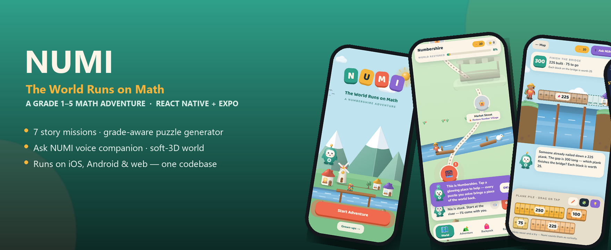
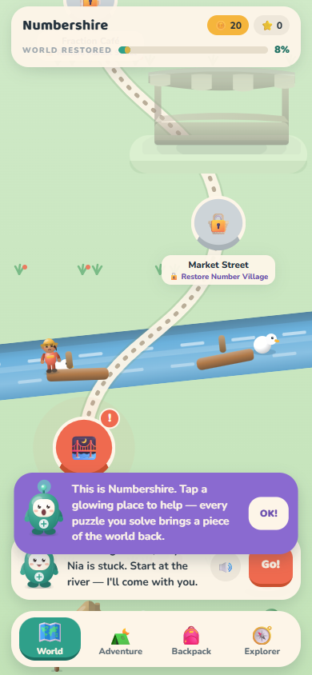
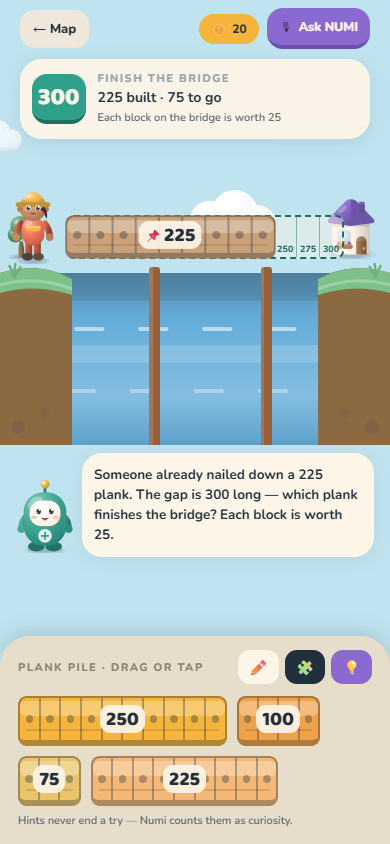
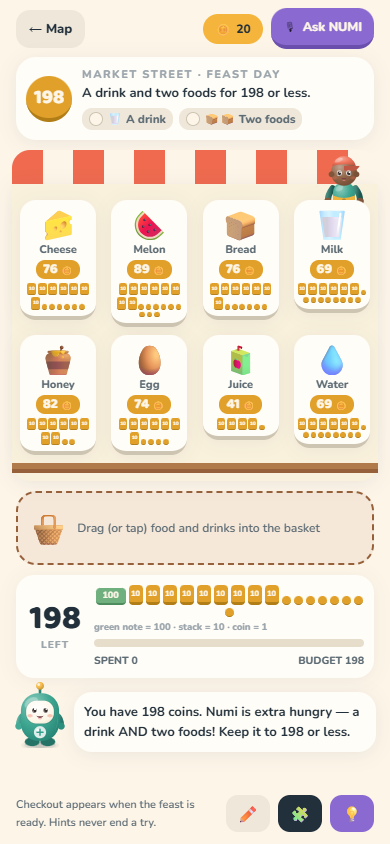
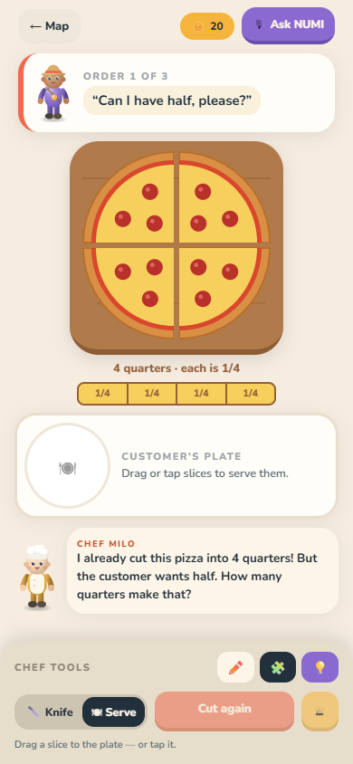
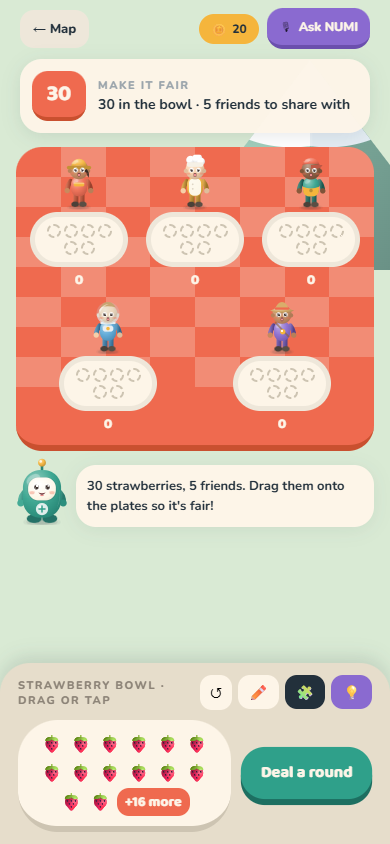
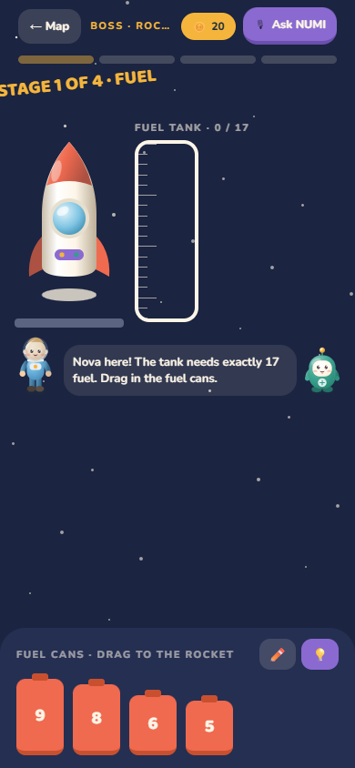
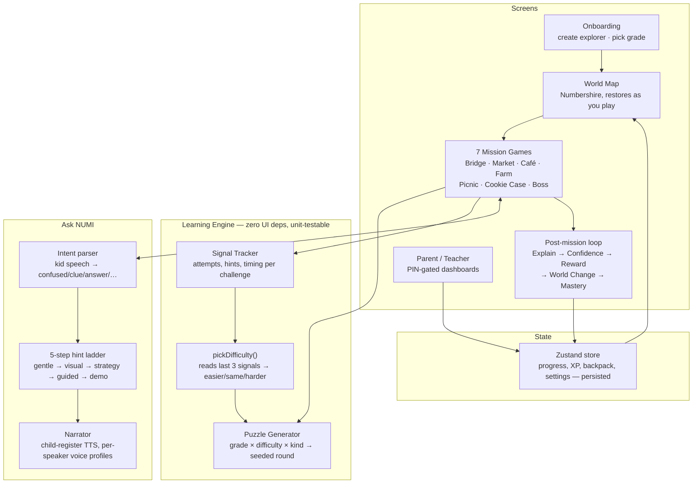

<div align="center">



<br/>

[](https://numi-math.vercel.app)
[](https://expo.dev)
[](https://reactnative.dev)
[](https://www.typescriptlang.org)
[](#-run-it-yourself)

**A K–5 math adventure where children learn by *doing* — dragging, building, sharing,
measuring — and never by answering a quiz question.**

[**▶ Try the live demo**](https://numi-math.vercel.app) &nbsp;·&nbsp;
[Screenshots](#-screenshots) &nbsp;·&nbsp;
[How NUMI teaches](#-how-numi-teaches) &nbsp;·&nbsp;
[Architecture](#-architecture) &nbsp;·&nbsp;
[Run it yourself](#-run-it-yourself)

</div>

<br/>

## ✨ Why NUMI is different

Most "educational" math apps are a quiz with a cartoon mascot bolted on. NUMI isn't.

Every mission is a **real problem embedded in a real place** — a bridge that's missing
planks, a market stall with a budget, a pizza that needs cutting into fair slices. The
child never sees "What is 7 + 9?" on a worksheet. They see a gap in a bridge that's 16
long, pick up a plank, and the bridge either holds or it doesn't. **Solving the puzzle
*is* the answer** — there is no separate "submit" step, and the equation is only
revealed *after* they've already solved it, as a celebration of what they just did.

- 🧩 **No quiz screens, anywhere.** Math is always physical: drag, build, cut, share.
- 🎓 **Actually grade-aware.** Grade 1 and Grade 2 never see the same numbers — each
  of the 5 grades has its own ranges, its own crossing-ten mechanics, and its own mix
  of problem *kinds* (see the [table below](#-how-numi-teaches)).
- 🗣️ **Ask NUMI** — a voice companion that never gives the answer. It walks a 5-step
  hint ladder (*gentle → visual → strategy → guided → demo*) and reads the *actual*
  numbers on the child's screen back to them, not a generic script.
- 🌍 **The world visibly repairs itself.** Every mission solved fixes a piece of
  Numbershire — a bridge gets rebuilt, market stalls open, lights come on. Progress is
  something you can *see*, not a progress bar.
- 🔊 **Gentle by design.** Soft child-register voice, sound effects that duck under
  speech, haptics — and a single switch to turn any of it off.
- ♿ **Voice is never required.** Every voice interaction has a touch/tap fallback.

<br/>

## 📱 Screenshots

<table>
<tr>
<td width="33%"><br/><sub><b>Numbershire</b> — the hero screen. Every restored area is a solved mission, drawn back into the world.</sub></td>
<td width="33%"><br/><sub><b>Bridge Builder</b> (addition) — a pre-laid plank plus the pile; find what completes it. Numbers scale with grade (here: hundreds, one block = 25).</sub></td>
<td width="33%"><br/><sub><b>Market Street</b> (money) — a drink + two foods, budget shown as notes/stacks/coins once numbers get big.</sub></td>
</tr>
<tr>
<td width="33%"><br/><sub><b>Fraction Café</b> (fractions) — a pre-cut pizza teaches 2/4 = 1/2 by asking for a "half" of a pizza already in quarters.</sub></td>
<td width="33%"><br/><sub><b>The Fair Picnic</b> (division) — sharing with remainders: leftovers that can't be split fairly stay in the bowl.</sub></td>
<td width="33%"><br/><sub><b>Rocket Launch</b> — the end-of-world boss: fuel (addition), food packs (division) and cargo (subtraction) in one mission.</sub></td>
</tr>
</table>

<br/>

## 🎯 How NUMI teaches

Two independent dials decide every round: **grade** sets the mathematics, and the
child's **own recent performance** nudges numbers kinder or tougher inside that grade.
On top of that, each mission rotates between several **kinds** of problem so the same
idea never gets stale.

| Mission | Skill | Grade 1 | Grade 3 | Grade 5 | Problem kinds |
|---|---|---|---|---|---|
| 🌉 Bridge Builder | Addition | gaps 5–10 | 60–200 (×10 blocks) | 600–1,500 (×50 blocks) | two planks · one already placed · three planks |
| 🧺 Market Street | Money | 6–10 coins | 30–100 | 300–900 | under budget · feast (3 items) · exact change |
| 🍓 The Fair Picnic | Division | share 2 ways | 3–5 ways, **with leftovers** | 5–6 ways, with leftovers | equal share · share with a remainder |
| 🥕 Carrot Rows | Multiplication | 2 rows | 3–5 rows | 5–6 rows, tables to 9 | plant an empty garden · fix a lopsided one |
| 🍰 Fraction Café | Fractions | halves | 2 customers, ½ & ¼ | 3 customers | cut a whole pizza · read a pre-cut one |
| 🕵️ The Cookie Case | Subtraction | 6–10 | 21–35 | 45–70 | count by ones · count by tens once big |
| 🚀 Rocket Launch | All of the above | — | a 4-stage boss scaled to the child's grade | — | fuel + supplies + cargo + countdown |

A puzzle generator (`src/learning/generator.ts`) produces every round from a seed —
deterministic, and brute-force verified against **9,000 generated puzzles per mission**
across every grade × difficulty combination, with zero invariant failures (every
puzzle is solvable, and every "unique answer" puzzle has exactly one answer).

<br/>

### The core scenario, start to finish

World map → Number Village → *"OH NO!"* → Bridge Builder:

1. The child places a wrong plank. The game gives soft feedback: a wobble and a plain
   description of what that plank makes — never "Incorrect."
2. They try again, then pause. NUMI notices and gently offers help.
3. They tap **Ask NUMI** and say "I don't understand." NUMI answers from the *real*
   bridge on screen: *"You already built 8. We need 15 — how many more would make 10?"*
4. They answer **2**, then **5**, watching the matching blocks glow, then drag in the
   **7** and the bridge repairs itself. Nia crosses. The equation appears only now:
   `8 + 2 + 5 = 15` → `8 + 7 = 15`.
5. NUMI asks *"How did you figure that out?"* and recognises the strategy —
   **New Strategy Discovered: Make a Ten**.
6. Confidence check-in → Reward → the world visibly changes (bridge rebuilt, Market
   Street unlocks) → a mastery moment → back to the map, where the fix is permanent.

<br/>

## 🏗 Architecture



**Design decisions worth knowing about:**

- **Everything the child sees is generated, not hand-authored.** No two rounds of
  "Bridge Builder" are the same puzzle — a seed + the child's grade + their recent
  signals produce a fresh, always-solvable round every time.
- **The learning engine has zero UI dependencies.** `src/learning/` is plain
  TypeScript — it's brute-force tested from the command line, independent of
  React/React Native, which is how a 9,000-seed invariant check runs in seconds.
- **Art is all vector, no image assets.** Every character, building and prop is
  `react-native-svg` with soft radial-gradient shading — no PNG sprite sheets, so it's
  crisp at any size and themeable from one token file (`src/theme/tokens.ts`).
- **One codebase, three platforms.** The same TypeScript ships to iOS, Android and
  web via Expo — including working drag-and-drop, which needed a
  `react-native-gesture-handler` + `react-native-reanimated` combination that behaves
  identically across all three (Reanimated can't animate SVG props on web, so
  character motion uses wrapper-view transforms instead).

<br/>

## 🧰 Tech stack

| | |
|---|---|
| **Framework** | Expo SDK 57 · React Native 0.86 · React 19 |
| **Language** | TypeScript (strict mode) |
| **Animation** | Reanimated 4 · react-native-gesture-handler |
| **Graphics** | react-native-svg (100% vector art, no bitmap sprites) |
| **State** | Zustand + AsyncStorage persistence |
| **Voice** | expo-speech (TTS) · Web Speech API (recognition, with touch fallback) |
| **Audio** | expo-audio · self-synthesised WAV sound effects (`scripts/make-sfx.js`) |
| **Fonts** | Baloo 2 (display) · Nunito (body) |
| **Hosting** | Vercel (web) · EAS Build (Android/iOS) · Expo Go (instant device preview) |

<br/>

## 📂 Project structure

```
src/
├── components/     Reusable UI: characters, scenery, drag-and-drop, the Ask NUMI panel
├── data/           World data — skills, areas, missions, characters, items
├── learning/        engine.ts     hint ladder, intent parsing, strategy detection
│                    generator.ts  the grade-aware puzzle generator (pure, seeded, tested)
│                    session.ts    live per-challenge signal tracking
├── navigation/      React Navigation stacks + the post-mission flow controller
├── screens/
│   ├── onboarding/  splash, story, create-explorer, choose-grade
│   ├── games/       the 7 mission games
│   ├── loop/         Explain → Confidence → Replay → Reward → WorldChange → Mastery
│   ├── tabs/        World map, Adventure, Backpack, Explorer (Me)
│   ├── companion/   Strategy Book, Learning Partners, Math Around Me, Class Mission
│   └── grownups/    PIN-gated Parent, Teacher and Learner dashboards
├── services/        narrator (TTS), sfx, feedback (haptics), listen (speech recognition)
├── store/           the persisted Zustand game store
└── theme/           design tokens — palette, type scale, motion presets
```

<br/>

## 🚀 Run it yourself

```bash
git clone https://github.com/dhanushree-m-y/Nerdy-.git
cd Nerdy-
npm install
npx expo start          # press a = Android, i = iOS, w = web
```

Then press **`w`** for web, or scan the QR code with **Expo Go**
([iOS](https://apps.apple.com/app/expo-go/id982107779) ·
[Android](https://play.google.com/store/apps/details?id=host.exp.exponent)) to run it
on your own phone instantly — no build required.

**Building an installable app:**

```bash
npx eas build --platform android --profile preview   # → downloadable .apk
npx eas build --platform ios --profile preview         # → TestFlight (needs an Apple dev account)
```

**Resetting progress:** open Grown-ups (PIN gate) → **Reset progress**.

<br/>

## 🔊 Sound & voice

**Tone:** calm. NUMI reads at a soft, low-ish pitch and an unhurried pace, sentence by
sentence with a small breath between each — a bedtime-story read, not a cartoon.

- **Sound effects** live in `assets/sfx`, generated by `node scripts/make-sfx.js` —
  short WAVs synthesised from sine partials with gentle envelopes. Playback is
  `src/services/sfx.ts`; every effect is mixed low and ducks while NUMI is talking.
- **Where they play:** a soft wooden tick on taps, a snap when a piece lands, a
  two-note rise for correct, a gentle low tone for "not quite," an arpeggio for
  mission complete, a bell for a new strategy, and a quiet meadow pad on the map.
- **Read-aloud:** tap any `SpeakableText` or the 🔊 `SpeakButton` to hear it — the
  word being spoken highlights in colour as it's read.
- **Everything is optional**, per-toggle, in the Explorer tab: Sounds, Background
  music, NUMI's voice, auto-read, voice style (Calm/Playful), and speed. With sound
  off, captions still animate at reading pace.
- **Speech recognition** uses the Web Speech API where available. If the mic isn't
  available (permission denied, or turned off by a grown-up), NUMI falls back to
  "say-it" chips — the child taps what they'd say instead. **Every voice interaction
  has a touch alternative**; voice is never required to play.

<br/>

## 🔁 Replay & pacing

- **Endless rounds.** `src/learning/generator.ts` builds fresh, seeded puzzles for
  every mission. Difficulty follows the child's own recent signals — clean and quick
  play nudges it harder, repeated struggle nudges it kinder — and the starting
  representation (symbols vs. blocks vs. groups) adapts the same way.
- **Play another** appears beside Continue after a win, so a mission can run as long
  as a child is enjoying it, feeding "practice" signals without paying stars twice.
- **Break reminder:** a gentle "time to stretch" card after an interval grown-ups
  choose. It never locks the child out.
- **Seasons:** once every area is restored, the map celebrates and offers a new
  season — powers and backpack carry over, and every place needs help again with new
  puzzles at the child's now-higher skill level.

<br/>

## ♿ Accessibility & safety

- Reduced motion, large touch targets, captions, adjustable speech speed, and
  independent sound/haptics switches — all grown-up controlled.
- Feedback never relies on colour alone.
- Microphone and camera are off by default and need a grown-up to enable.
- NUMI gently steers off-topic chat back to the puzzle at hand.
- **No leaderboards, no public rankings, no comparison between children — ever.**
- Every draggable piece carries a spoken accessibility label for screen readers.

<br/>

## ✅ Quality bar

- `npx tsc --noEmit` — clean, strict mode, zero errors.
- Puzzle generator brute-force verified: **9,000 seeds × grade × difficulty per
  mission**, checking every puzzle is solvable and every "unique answer" puzzle has
  exactly one solution.
- Audited and fixed against **7 phone sizes**, from an iPhone SE (320px) to an iPad —
  every game scene scales or scrolls so nothing is ever cut off-screen.

<br/>

## 🗺 Known limitations

- Fractions currently only cut into halves and quarters at every grade (thirds or
  eighths would need a new knife-cut mechanic).
- No decimals or long division yet — Grade 5 grows through bigger numbers and more
  steps, not new topics, since every game shows real, countable objects on screen.
- The parent PIN is stored locally, unhashed — fine for a prototype/demo, not for
  production without hardening.
- The camera flow in Math Around Me uses an illustrated sample photo; no camera
  module is wired up yet.
- Speech recognition uses the Web Speech API (web + Android Chrome); a native
  on-device recogniser would be needed for full offline iOS support.

<br/>

## 🛠 Dev notes

- In development (`__DEV__`), `globalThis.__numi` exposes `{ store, nav }` so any
  screen can be reached instantly while testing.
- Type-check: `npx tsc --noEmit`.

<br/>

## 📄 License

See [LICENSE](LICENSE).

<div align="center">
<sub>Built with Expo, React Native, and a lot of attention to what actually makes a 6-year-old want to keep playing.</sub>
</div>
